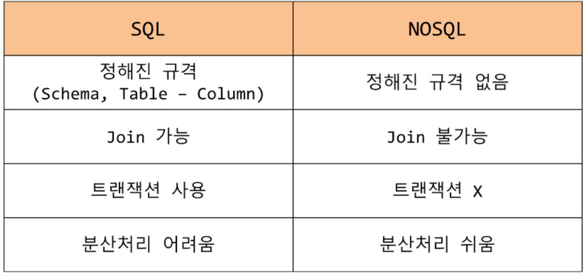

# No SQL (Not only SQL)

### 기존의 RDBMS 형태의 관계형 데이터 베이스는 데이터의 관계가 긴밀히 연결되어 있는  형태입니다.
### 하지만 Not only SQL 즉, 관계형 데이터베이스 관리 시스템에 쓰이는 SQL (Structure Query Language)  뿐만이 아니기 때문에 말 그대로 비슷하면서 다르다는 것이다.

## 무엇이 다른가?

1. RDBMS 형태와는 다른 데이터 저장 방식, 구조를 가진다.

2. Foreign Key 등으로 데이터의 관계가 정의되어 있는 RDBMS 방식과 다르게 NoSQL은 
    데이터 간의 관계를 정의하지 않습니다.
3. 빅데이터에 효율적이다.
4. 데이터를 여러 서버에 분산 저장이 가능하고 복제와 회복이 가능한 형태다.  장애가    발생하더라도 대응이 유리하다.
5. Schema가 유동적이다.
 
 

출처 : [잔재미코딩](https://www.fun-coding.org/mongodb_basic1.html)