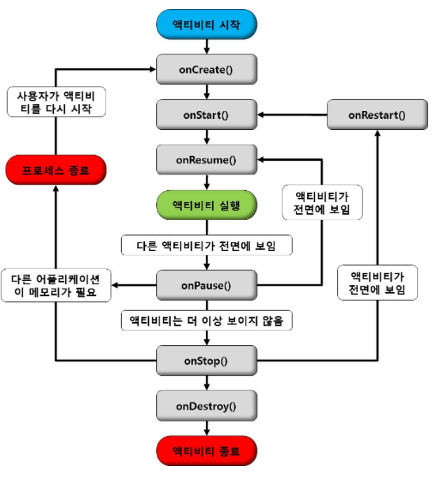

## Activity Life cycle
#### 액티비티는 다음 그림과 같은 생명 주기 (LifeCycle) 를 가지고 있다.
 

#### 위 그림과 같이 생명 주기는 onCreate() => onStart() => onResume() => onPause() => onStop() => onDestroy() 순으로 실행되며, 경우에 따라 onRestart() 메소드가 호출 되기도 한다.
#### 이에 대한 자세한 설명은 다음 표에 설명하겠다.

1. onCreate() 액티비티가 생성될 때, 호출되며 사용자 인터페이스 초기화에 사용됨
다음 메소드 => onStart()
2. onRestart() 액티비티가 멈췄다가 다시 시작되기 바로 전에 호출됨
다음 메소드 => onStart()
3. onStart() 액티비티가 사용자에게 보여지기 바로 직전에 호출됨
다음 메소드 => onResume() || onStop()
4. onResume() 액티비티가 사용자와 상호작용하기 바로 전에 호출됨
다음 메소드 => onPause()
5. onPause() 다른 액티비티가 보여질 때, 호출됨. 데이터 저장, 스레드 중지 등의 처리를 하기에 적당한 메소드
다음 메소드 => onResume() || onStop()
6. onStop() 액티비티가 더이상 사용자에게 보여지지 않을 때, 호출됨.
메모리가 부족할 경우에는 onStop() 메소드가 호출되지 않을 수도 있음.
다음 메소드 => onRestart() || onDestroy()
7. onDestroy() 액티비티가 소멸될 때 호출됨. finish() 메소드가 호출되거나 시스템이 메모리 확보를 위해 액티비티를 제거할 때 호출됨.
다음 메소드 => 없음
