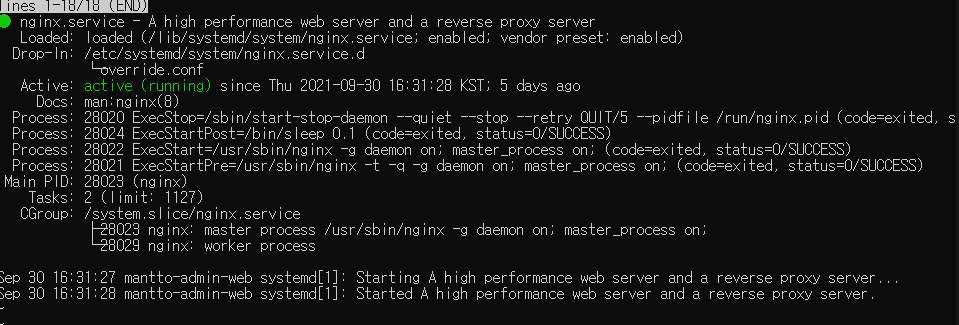
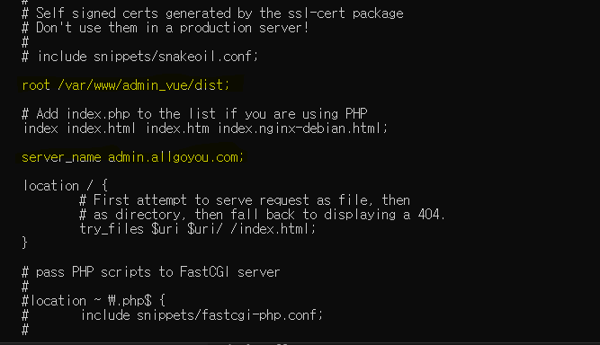

### Nginx 로 React 배포하는 법 with Docker

React → 보통 Create React App 의 경우 Webpack 이 내장되어 있다. Webpack dev Server 의 경우 Hot-Reload 기능과 같은 개발에 필요한 것들을 제공해주는 웹 서버이므로 운영 환경 ( 배포 환경 ) 에 사용하기에는 부적절하다. ( 사용할 수는 있지만, 불필요한 부분들이 많고 무겁다. ) 따라서, nginx 와 같은 가벼운 소프트웨어로 웹 서버를 구축하여 배포하면 비교적 효율적이다. Docker 를 사용하면 nginx 를 쉽고 빠르게 구축하여 사용할 수 있다.

아래는 위에서 설명한 환경 구축을 위한 첫번째 단계로 docker 빌드를 위한 Dockerfile 이다.

```docker
FROM node:alpine as builder
WORKDIR 'usr/src/app'
COPY package.json .
RUN npm install
COPY ./ ./
RUN npm run build

FROM nginx
COPY --from=builder /usr/src/app/build /usr/share/nginx/html

```

도커 파일은 dev 버전과 production 배포 버전 두가지로 설정해 사용해주는 것이 좋다

#### nginx 배포 방법 vux js ( 도커 없이 배포해보기 )
 

배포 성공! 배포 과정은 다음과 같다.

- 가장 힘들었던 것은 root 설정을 제대로 해주지 못했던 것이다!

#### AWS 인스턴스 생성 후 ssh 연결하여 로컬 터미널 환경에서 진행했다.
#### AWS instance OS - Ubuntu 18.04 - LTS / CPU - 2Core, RAM - 1g

1. ssh - i key.pem @ubuntu@ ~ ip ~ 입력 - > 보안 그룹 설정해줘야 진입 가능하다. 아니면 타임아웃 발생
2. sudo apt update / sudo apt upgrade / sudo apt-get install nginx ( 순서대로 입력 )
3. root 경로로 이동한다. cd .. cd .. ( 루트로 바로 가는 명령어가 있을 것이다.) cd ~ ?
4. lib / bin 등 파일이 있는 경로로 왔다면, etc 파일을 찾는다.
5. /etc/nginx/sites-enabled 로 이동한다. 거기서 default 파일을 vim 을 통해 연다. vi default
6. 아래와 같이 노란 부분을 수정해준다.
    - root -> nginx 가 해당 파일에서 참조해서 빌드파일을 실행시켜준다.
    - ( 원래는 /var/www/html 이 default 로 설정되어 있다. )
    - git clone 해서 npm run build 해준 뒤에 dist 파일 경로를 root 에 넣어준다고 보면 된다.
    - 설정가능한 다른 nginx.conf / sites-available 도 있는데 nginx 는 해당 파일들을 종합해서 적용하는 듯 하다 ( 추측/ 좀 더 찾아보자 )
    - /var/www/html 이 부분도 4 와 동일한 경로로 가면 찾을 수 있다.
7. 어쨋든 6 까지 진행한 후 nginx 를 start 해주면 맨 위 스샷과 같이 배포 성공!


