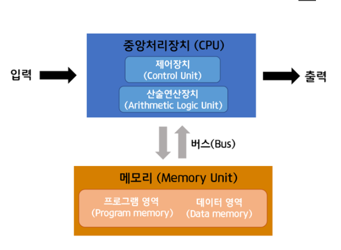

### 폰노이만 구조?
1. 폰노이만 구조는 에드박의 보고서 최초 초안에서 수학자이자 물리학자 존 폰 노이만 과 다른 사람들이 서술한 1945년 설명에 기반한 컴퓨터 아키텍처이다.
- 산술 논리 장치와 프로세서 레지스터를 포함하는 처리 장치
- 명령 레지스터와 프로그램 카운터를 포함하는 컨트롤 유닛
- 데이터와 명령어를 저장하는 메모리
- 외부 대용량 스토리지
- 입출력 메커니즘

### 폰노이만의 업적?
- 현재와 같은 CPU, 메모리, 프로그램 구조를 갖는 범용 컴퓨터 구조의 확립이다.
- 맨해튼 프로젝트 참여 당시 발표한 논문 < 전자 계산기의 이론 설계 서론 > 에서 CPU, 메모리, 프로그램 구조를 갖는 프로그램 내장 방식의 컴퓨터의 아이디어를 처음 제시하였다.

#### 폰 노이만 병목 현상
- 폰 노이만 병목 현상은 일반적으로 자료 경로의 병목 현상 또는 기억 장소의 지연 현상을 이르는 말이다.
- 나열된 명령을 순차적으로 수행하고, 그 명령은 일정한 기억장소의 값을 변경하는 작업으로 구성되는 폰 노이만 구조에서 기인한다.  
 
