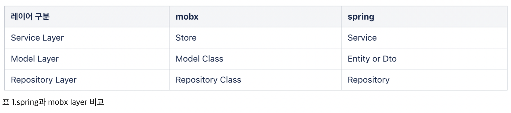

### MobX 란?
- Flux 아키텍처를 따르면서, redux 보다는 보일러 플레이트가 적고, Spring 과 같이 @ 데코레이터? 를 사용한다.
- UI 와 비즈니스 로직을 분리하여 UI 가 여러 형태로 변경되더라도 상태 관리 흐름에 영향을 주지 않는 것을 원칙으로 만들어진 상태 관리 라이브러리이다.
#### MobX 아키텍처

1. Store = Service ?
    - Mobx store 의 경우, observable 한 state(상태)를 가지고 있다.
    - Store 는 싱글톤으로 유지해야한다.

2. Repository = Repository ?
    - Mobx Repository는 Ajax로 데이터를 가져오는 부분이다. 데이터를 가져오는 부분도 Layer를 나누어 구성하는 것을 권장하고 있다.  
    비즈니스 로직 분리의 이점도 있지만 Test 코드 작성 시 Mocking이 용이 하다는 장점도 있다. 

3. Model = Entitiy or DTO ?
    - 