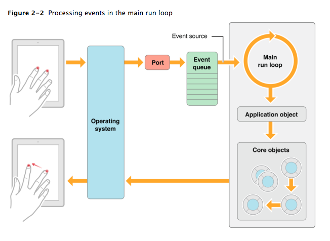

### IOS 앱 구동 방식 / life cycle

- 앱의 메인 런 루프는 모든 유저가 발생하는 이벤트에 따라 처리된다. 
- UIApplication 객체는 앱이 실행이 될때, 이벤트가 처리될때, 뷰 기반의 인터페이스에서 업데이트가 발생할때 setup된다. 
- 이름에서 볼 수 있듯이 메인 런 루프는 앱의 메인 쓰레드를 실행한다. 이러한 것들은 앱 사용자가 발생하는 이벤트를 순차적으로 처리하기위해 사용된다.

- 터치가 발생했을때, UIKit의해 설정된 Port를 통해 내부의 Event queue에 이벤트를 담겨놓는다. 
- 담겨있는 이벤트를 Main run loop에서 하나하나씩 실행된다. 그리고 실행된 결과를 결정짓는다. 
- 대표로 예를 든 이벤트는 touch event들이고 다른 이벤트들 또한 비슷한 동작 원리로 동작된다.
 

