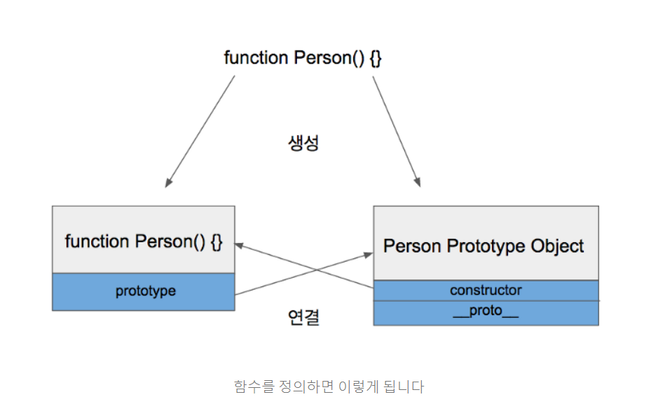
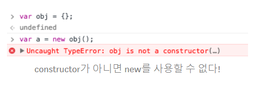
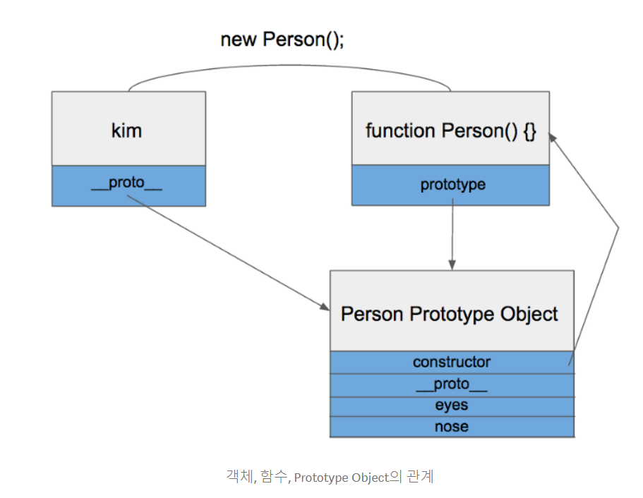
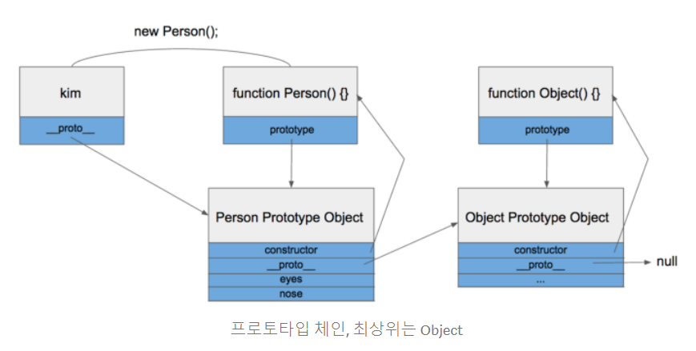

# Prototype 언어 - javascript 만의 특징?

### java, python 같은 언어에는 class 라는 개념이 있고 이를 활용해 객체 지향 언어로써 <br> 많은 곳에 활용되고 있다. 하지만 javascript 에는 이런 class 라는 개념이 없고 대신 prototype 이라는 javascript<br>만의 개념을 가지고 있다. 이것에 대해서 알아보고자 한다.
<br>

## javascript 에서 함수란 무엇인가?
-----------------------
### 결론부터 말하면 함수는 객체이다. 그래서 일급 객체(first-class) 함수를 값으로 다룰 수 있는 것이다.<br> 함수를 변수에 담아 원할 때 평가(호출) 할 수 있다. 변수의 특성인 함수 인자로 전단 가능하며<br>리턴값으로도 사용 가능하다.
<br>

## 함수가 객체면 프로퍼티를 가지는가?

>### 프로퍼티(property)는 해당 object의 특징입니다. property는 보통 데이터 구조와 연관된 속성을 나타냅니다.

### 맞다. 객체는 언제나 함수로 생성되기에 프로퍼티를 가진다.

```javascript
function Person() {} // => 함수
var personObject = new Person(); // => 함수로 객체를 생성
```

### 위 코드에서 personObject 객체는 Person 함수로 생성된 객체이다. 이렇게 언제나 객체는 함수에서 시작된다.<br> 일반적인 객체 생성도 예외는 아니다.

```javascript
var obj = {};


var obj = new Object();
```

### 위 코드도 사실은 바로 아래 코드와 동일하다.
### Object() 는 기본적으로 자바스크립트가 제공하는 함수이다.

### Object와 마찬가지로 원시적인 변수를 제외하고 Function Array도 모두 함수로 정의되어있다.

## 이것이 바로 Prototype Object 의 시작이다.


>### 함수는 객체이고 우리가 함수를 정의하면 함수만 생성되는 것이 아니고, Prototype Object도 같이 생성된다.<br>

### 그리고 생성된 함수는 prototype 이라는 속성을 통해 Prototype Object에 접근 할 수 있다.
### Prototype Object는 일반적인 객체와 같으며 기본적인 속성으로 constructor 와 __proto__를 가지고 있다.

### 위 그림에도 나와있듯이 Constructor는 생성된 함수를 가리키고 있다.

<br>


>### But, 모든 함수가 객체를 만들수 있는 것은 아니다. constructor 자격이 필요하다.<br> 자격이 부여되면 객체를 만들 수 있게 된다. 이것이 함수만 new를 사용할 수 있는 이유이다.

# Prototype Link ? __proto__ 의 비밀

### prototype 속성은 생성된 함수만 가지고 있었던 것과는 달리 __proto__ 속성은 모든 객체가 빠짐없이 가지고 있는 속성이다.

## proto 속성은 객체가 생성될 때 조상이었던 함수의 Prototype Object를 가리킨다.

### 여기까지 정리하면,,,





### 위 그림처럼 되는 것을 prototype chain 이라고 한다.

### 이런 프로토타입 체인 구조 때문에 모든 객체는 Object 의 자식이라고 불리고, Object Prototype Object 에 있는 모든 속성을 사용할 수 있다.
### 한가지 예를 들면 toString 함수가 있다.


## 이런 javascript 의 이해를 바탕으로 Promise를 이해해보려한다.
<br>
> 아! 그렇다면 promise도 결국엔 객체구나, resolve 가 작동하면 then 을 가진 객체를 리턴하는구나.