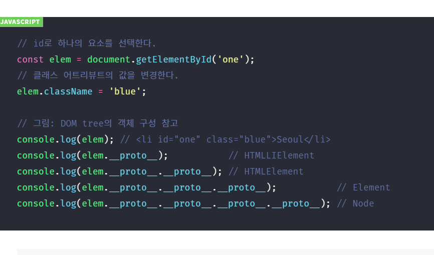

1. DOM 도 불려오면 프로토타입 객체다

( 당연한 소리다. 자바스크립트 객체는 전부 프로토타입과 프로토를 가진다 )

DOM API 로 불러온 elem 도 당연 프로토타입 객체이다. 프로토는 상위 프로토타입 객체를 가리킨다. 그래서 프로토를 타고 가면 최종 Node까지 도달한다.

2. 충격! DOM 도 사실상 상속이 아니라 프로토타입 객체 복제를 통해서 일어나는 거였다...!