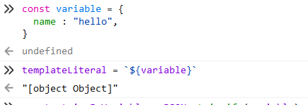
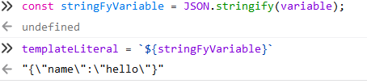

# react styled-components

템플릿 리터럴은 자주 사용해봤기 때문에 흔히 아는 내용이다. But,

태그 템플릿 리터럴은 무엇인가?

태그가 붙었기 때문에 템플릿 리터럴에서 못해준 기능이 추가됐을 것이다.

예를 들면, 객체나 함수 같은 경우를 변수에 할당해주고 템플릿 리터럴 형태로

${ 변수 } 이렇게 담아줄 수 있을까? 기존 템플릿 리터럴은 담아줄 경우

문자열 형태로 출력되버리고 끝이다.



위와 같이 객체라고 표시만 뜰 뿐 내부 값이 출력되지 않는다.

출력해주기 위해서는 stringify 해줘야한다.



이렇게 해주면, 객체가 JSON 형태로 출력된다.

JSON 형태 : { "key" : "value" }

아무튼, 이렇게 해줄 필요도 없이 그 내부에 넣은 자바스크립트 값을 조회하고 싶을 때는

Tagged Template Literal 문법을 사용하면 된다.

```javascript
const red = '빨간색';
const blue = '파란색';
function favoriteColors(texts, ...values) {
  console.log(texts);
  console.log(values);
}
favoriteColors`제가 좋아하는 색은 ${red}과 ${blue}입니다.`

```

texts는 템플릿 리터널에서 넣어준 문자열 배열이고, values 는 ${ value } 에 넣어준 값들을 모은 배열이다.

## 그래서 이걸 왜 설명하는건가 ?

우리가 쓰게 될 styled-components 가 이런 구조로 이뤄져 있기 때문이다.

styled-components 를 이해하기 위해서 공부하고 있다.

조금 더 활용해서 reduce 배열 메서드를 활용해보면, 조금 어렵지만 다음처럼 사용해줄 수 있다.

```jsx
const red = '빨간색';
const blue = '파란색';

function favoriteColors(texts, ...values) {
   return texts.reduce((result, text, i) => 
`${result}${text}${values[i] ? `<b>${values[i]}</b>` : ''}`, '');
}

favoriteColors`제가 좋아하는 색은 ${red}과 ${blue}입니다.`
// 제가 좋아하는 색은 <b>빨간색</b>과 <b>파란색</b>입니다.

```

위의 favoriteColors 함수가 컴포넌트라고 보고, 아래 위를 비교해보면 styled-components 의

구조를 어느정도 파악할 수 있다.

**styled 라는 컴포넌트 안이 위** favoriteColors **의 함수형 컴포넌트처럼 구성되어 있구나 정도?**

그리고 아래는 함수 표현식으로 StyledDiv 에 담아준 것이다. 리액트에서는 JSX 만 반환해주면,

모두 컴포넌트로 보기 때문에 아래 위 예시는 모두 컴포넌트다.

```jsx
const StyledDiv = styled`
  background: ${props => props.color};
`;
```
```jsx
function styled(texts, ...functions) {
    const mockProps = {
	color : "red";
}
    return texts.reduce((result, text, i) =>
`${result}${text}${functions[i] ? functions[i](mockProps) : ''}, ''}`;
}
//                       mockProps => mockProps.color === ("red")

const StyledDiv = styled`
  background: ${props => props.color};
`;
// "background : red"
```
```jsx
function styled(texts, ...functions) {
    const mockProps = {
	color : "red";
}
    return texts.reduce((result, text, i) =>
`${result}${text}${functions[i] ? functions[i](mockProps) : ''}, ''}`;
}
//                       mockProps => mockProps.color === ("red")

const StyledDiv = styled`
  background: ${props => props.color};
`;
// "background : red"
```

위에서 배운 것을 근거로 실제 styled-components 의 내부 구성을 생각해보자
```jsx
const Circle = styled.div`
  width: 5rem;
  height: 5rem;
  background: black;
  border-radius: 50%;
`;

function App() {
  return <Circle />;
}
```
```jsx
기존의 방법

function Circle (props) {
    const style = {
	display : "flex",
	boreder-radius : "50%",
	background : "black",
	width : "5rem",
	height : "5rem"
}
    return (
	<div style={style}></div>
)
}

styled-components 내부?

styled = {
	div : Styled("div")
	...
}

function styled(selector) {
   const styledEl = document.querySelector(selector);
   return function(cssText) {
	const cssStyles = cssText.toString().split(";")
	const cssKeyValues = cssStyles.map(style => style.split(":"))
	cssKeyValues.forEach(([key, value]) => {
		if(key && value) {
			styledEl.style.[key.trim()] = value.trim()
		}
	})
	return styledEl;
	}
}

function Circle(props) {
    return Styled("div")([배열 형태로 받아옴])
}


========================================

const Circle = styled.div`
  width: 5rem;
  height: 5rem;
  background: black;
  border-radius: 50%;
  background : ${props => props.color || 'black'};
`;
// <div style="width : 5rem; height : 5rem; background : black; border-radius : 50%;">

function App() {
  return <Circle color="blue"/>; = <div style="width : 5rem; height : 5rem; background : black; border-radius : 50%;">;
}

```

styled-component 내부는 고차함수로 이뤄져있다고 할 수 있다.

return 값을 또 함수로 만들어서

styledTag("h1") < = h1 을 넣었을 때, function 이 반환되고

function([배열]) 로 `템플릿 리터럴` 로 들어간 값들이 전부 파싱되어 h1의 인라인 스타일로 들어가게된다.

[참고 영상](https://www.youtube.com/watch?v=ZQcILg_OvY0) 

그럼 함수는 어떻게 넘어올까?

```javascript
// 정리

// # 1

function App() {
    return <Circle color="blue"/>
}

const Circle = styled.div`
  width: 5rem;
  height: 5rem;
  background: black;
  border-radius: 50%;
  background : ${props => props.color || 'black'};
`;

// # 2

function Circle(props) {
    return styled.div`
	  width: 5rem;
	  height: 5rem;
	  background: black;
	  border-radius: 50%;
	  background : ${props => props.color || 'black'};
	  `
}

// # 3 
styled = {
	div : styled("div")
	input : styled("input")
	.
	.
	.
}
function styled(selector) {
   const styledEl = document.querySelector(selector);
   return function(cssText) {
	const cssStyles = cssText.toString().split(";")
	const cssKeyValues = cssStyles.map(style => style.split(":"))
	cssKeyValues.forEach(([key, value]) => {
		if(key && value) {
			styledEl.style.[key.trim()] = value.trim()
		}
	})
	return styledEl;
	}
}

// # 4

function Circle(props) {
    return <div style="
	width : 5rem; 
	height : 5rem; 
	background : black; < = props.color 있었으면 해당 color 적용.
	border-radius : 50%;
	">
}
```

### 이렇게 정리하면서, tagged template literal 에 대해 알게되면서 동시에 <br/>
### styled-components 가 어떻게 동작하는지 어느 정도 이해 할 수 있었다.