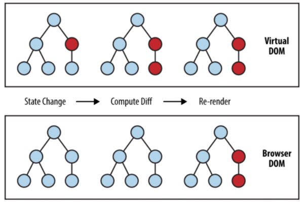

### 가상 돔 ?
- 가상 돔 개념이 등장한 이유는 DOM의 조작에 대한 복잡도가 날이 갈수록 증가하고 있기 때문이다. 
- 복잡도가 증가한다는 것은 DOM의 변화가 기하급수적으로 많이 발생한다는 것이다.

그리고 우리는 앞선 내용을 통해서 DOM에 변경이 있을 경우 렌더트리를 재생성하고(모든 요소들의 스타일이 다시 계산됨) 레이아웃을 만들고  
페인팅을 하는 과정이 다시 반복되는 것을 알 수 있었다. 즉, 브라우저가 연산을 많이 해야한다는 이야기이며,  
전체적인 프로세스를 비효율적으로 만든다는 것이다.

그래서 등장한 개념이 가상돔(VirtualDOM) 이다.

뷰(HTML)에 변화가 있을 때, 구 가상돔(Old Node)과 새 가상돔(New Node)을 비교하여 변경된 내용만 DOM에 적용한다.  
이를 통해 브라우저 내에서 발생하는 연산의 양(정확히는 렌더링 과정)을 줄이면서 성능이 개선되는 것 이다.

더 쉽게 말하자면 변화를 모아서 한 번에 처리하는 일종의 Batch 작업이다.



### REAL DOM 구성

```html
<div id="app">
  <ul>
    <li>
      <input type="checkbox" class="toggle" />
      todo list item 1
      <button class="remove">삭제</button>
    </li>
    <li class="completed">
      <input type="checkbox" class="toggle" checked />
      todo list item 2
      <button class="remove">삭제</button>
    </li>
  </ul>
  <form>
    <input type="text" />
    <button type="submit">추가</button>
  </form>
</div>
```
### Virtual DOM 구성
```javascript
function virtualDom(type, props, ...children) {
  return { type, props, children: children.flat() }
}

virtualDom('div', { id: 'app' },
  virtualDom('ul', null,
    virtualDom('li', null,
      virtualDom('input', { type: 'checkbox', className: 'toggle' }),
      'todo list item 1',
      virtualDom('button', { className: 'remove' }, '삭제')
    ),
    virtualDom('li', { className: 'completed' },
      virtualDom('input', { type: 'checkbox', className: 'toggle', checked: true }),
      'todo list item 2',
      virtualDom('button', { className: 'remove' }, '삭제')
    ),
  ),
  virtualDom('form',
    virtualDom('input', { type: 'text' }),
    virtualDom('button', { type: 'submit' }, '추가'),
  )
);
```
### Result

```json
{
  "type": "div",
  "props": {
    "id": "app"
  },
  "children": [
    {
      "type": "ul",
      "props": null,
      "children": [
        {
          "type": "li",
          "props": null,
          "children": [
            {
              "type": "input",
              "props": {
                "type": "checkbox",
                "className": "toggle"
              },
              "children": []
            },
            "todo list item 1",
            {
              "type": "button",
              "props": {
                "className": "remove"
              },
              "children": [
                "삭제"
              ]
            }
          ]
        },
        {
          "type": "li",
          "props": {
            "className": "completed"
          },
          "children": [
            {
              "type": "input",
              "props": {
                "type": "checkbox",
                "className": "toggle",
                "checked": true
              },
              "children": []
            },
            "todo list item 2",
            {
              "type": "button",
              "props": {
                "className": "remove"
              },
              "children": [
                "삭제"
              ]
            }
          ]
        }
      ]
    },
    {
      "type": "form",
      "props": {
        "type": "input",
        "props": {
          "type": "text"
        },
        "children": []
      },
      "children": [
        {
          "type": "button",
          "props": {
            "type": "submit"
          },
          "children": [
            "추가"
          ]
        }
      ]
    }
  ]
}
```
코드를 보면 알겠지만, **가상돔(VirtualDOM)**은 거창한게 아니라 DOM의 형태를 본따 만든 객체 덩어리다.

사실 가상돔(VirtualDOM)만 쓴다고해서 드라마틱한 변화가 생기는 것은 아니다.  
딱 하나 좋은 점은 RealDOM을 사용하지 않기 때문에 테스트 하기가 용이하다는 점 정도이다.  
가령, DOM API는 브라우저에만 존재하는데, VirtualDOM의 경우 굳이 브라우저 환경이 아니더라도 사용할 수 있는 것이다.

#### Diff 알고리즘이 적용
- 두 개의 트리를 비교할 때, React는 두 엘리먼트의 루트(root) 엘리먼트부터 비교합니다. 이후의 동작은 루트 엘리먼트의 타입에 따라 달라집니다.

