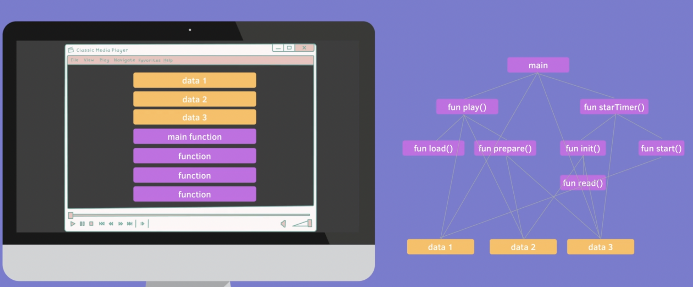
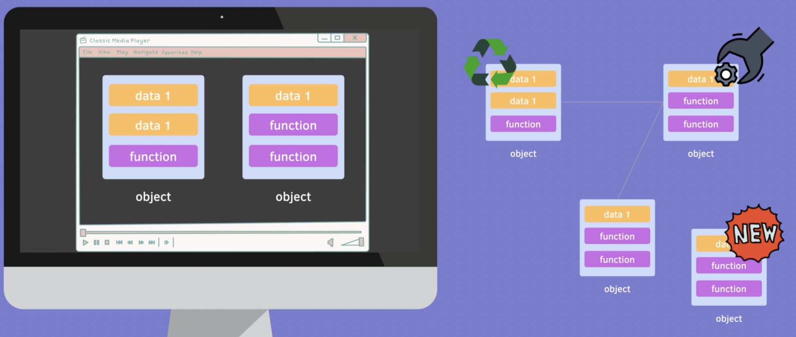
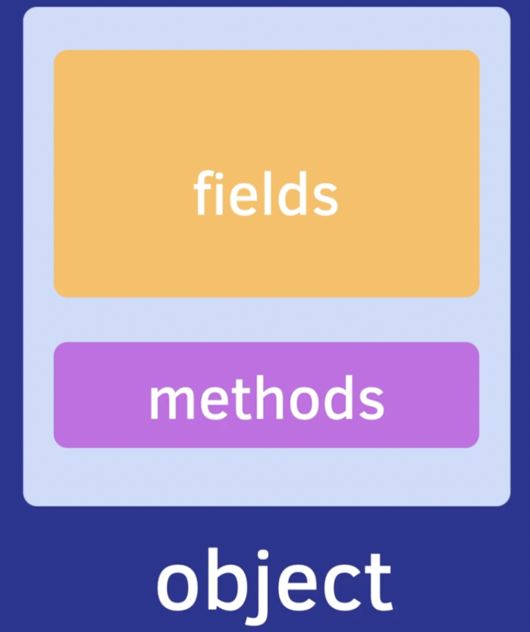

## Object Oriented Programming ( OOP ) - 객체 지향 프로그램

 

> ### Imperative and Procedural Programming ?  
> #### 객체 지향과 상반된 개념이다. 명령과 절차를 따르는 프로그래밍을 말한다.  
> - 보통 main 함수가 있으면 main 함수에서 각각의 함수를 호출 할 수 있고, 또 각각의 함수는 여러 함수들을 호출한다. 그리고 그 모든 함수들이 전역적으로 선언된 data 에 접근하여 프로그램이 돌아간다. 즉, 정의된 순서대로, 절차적으로 함수가 하나씩 호출되는 것을 절차지향 프로그래밍이라 한다.
> - 단점 : 
>1. 전체를 이해해야한다. 순서대로 모든 함수들을 찾아 들어가야 내가 찾고자하는 함수가 어떻게 동작되는지 파악할 수 있다.
>2. 절차 중간에 함수를 수정해줘야 한다면, 많은 사이드 이펙트를 고려해야 하고, 한 과정에서 문제가 발생하면 전체 프로그램이 꺼지는 문제가 발생한다.
>3. 특정 함수를 이해하는 데 어려움이 크다. 전반적인 절차를 이해해야 한다. ( 유지보수 어려움 )

 

 

### 객체 지향 프로그래밍의 장점 (vs 절차 지향 )
- 프로그램을 개체로 정의해서 개체들끼리 서로 의사소통 할 수 있도록 프로그래밍 하는 것을 말한다.
- 서로 관련있는 data 와 함수들을 개체로 묶어 정의하며 프로그래밍 해 나가는 것을 말한다.
- 사람과 가까운 생각을 하면서 객체를 구현하는 것을 말한다.
- 한 객체를 수정해준다면, 해당 객체만 이해하면 된다.
- 반복적인 객체의 경우, 재사용을 해줄 수 있다.
- 확장성도 좋다.
- 생산성이 높아진다.
- 따라서 유지보수에도 좋다.

## ( Data ) Fields => Properties | ( Function ) => Methods

## OOP 주요 개념 4가지
### 1. 캡슐화 ( Encapsulation )
- 객체의 필드(속성)와 메소드를 하나로 묶고 실제 구현 내용을 외부에 감추는 것을 말한다.
- 외부 객체는 객체 내부의 구조를 얻지 못하며 객체가 노출해서 제공하는 필드와 메소드만 이용할 수 있다.
- 예 ) 여자친구의 상태 ( 배고픔, 피곤함, 화남, 짜증남 ) 는 외부 Functions ( 카페가기, 영화보기, 맛있는 것 먹기 ) 등을 통해서만 변경이 가능하다.
### 2. 추상화 ( Abstraction )
- 내부의 복잡한 기능을 외부에서 간단한 인터페이스를 통해서 쓸 수 있는 것을 말한다.
- 커피 머신이 어떻게 동작하는 몰라도 간단한 버튼으로 커피를 추출할 수 있다.
### 3. 상속 ( Inheritance )
- 한번 잘 정의한 클래스를 재사용 할 수 있다. ( IS-A )
- Parent, Super, base < = > Child, sub, derived
### 4. 다형성 ( Polymorphism )
- 다양한 형태로 인스턴스화 된 객체에서 클래스에 정의된 함수를 정의할 수 있다.
